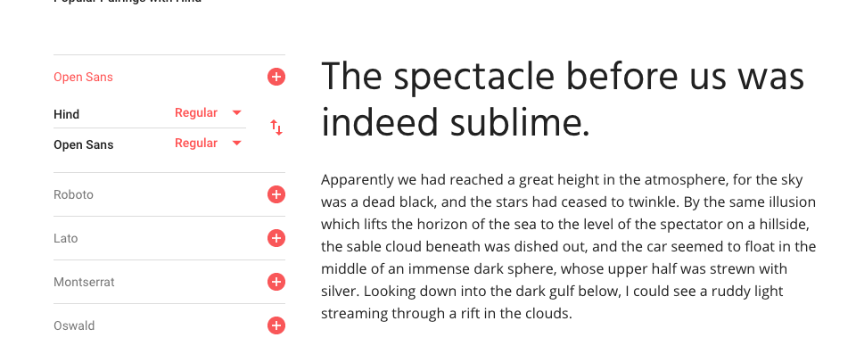

#Launched On AWS:
http://www.jack-hage.com

#Key Points

Severely under estimated the importance of mockups.

Coded mobile first then slowly expanded. Now fully responsive.

Launched on AWS

#Aim
> I wanted to produce a website that accurately represented both my skill sets in front end development and my preference in layouts and colours. A simple yet clean approach, I want to display as much vital information about myself yet be extremely brief and keep the viewers interested enough to continue reading/scrolling.

# Design
> In my design I was intending for a simple yet elegant approach. I wanted my colours and layout to be appealing to the eye yet not be "to much". I wanted to find the niche between plain and boring and obnoxious and overbearing. I wanted to remove complexity from my design and have a straight forward single page "scroller". I believe white text on a dark/black background displays that crisp, easy on the eye effect I was looking for. I also wanted to involve pictures relating to my text to add that little bit of extra personality to my website.

# Fonts
> I can't stand overbearing fonts. I believe a simple, structured clean font is always going to be the best for reading. Easy to read, nice to look at and neat. My font decisions were a rather peculiar process. I would go to the google fonts website and scroll as fast as possible and suddenly stop, examine the fonts displayed on the page and test them out on my figma mockup. I found Hind and Monda to be quite appealing and exactly what I was looking for. I also found Handlee to have the simpleness I was after but also to look a bit fancy to break the monotony.

# Intro Page
> I believe the first page that a user arrives on in a website is the most important. I kept information and text to a minimal to avoid immediate boredom. I wanted something to capture my user and make them intrigued and want to scroll down to find out information about me. I viewed hundreds of different suitable background images and narrowed it down to few choices. Once again I wanted to find the niche between boring and overbearing.

# TimeLine Of Events
> 23-02-2017
Had a full working site for a galaxy s5 but zero responsiveness what so ever. Started making small changes with reference to my figma mockup. Once again mockups proving to be so incredibly valuable(a week ago I was saying what a waste of time they were, had it all planned out in my head. BAD IDEA). Got ipad responsiveness working with media queries. Also implemented a fixed nav-bar which follows wherever you scroll. Did it by accident trying to achieve something else but I liked it so kept it. Adding final touches like proper hyperlinks.

> 22-03-2017:
Spent all day coding up a solution to my figma mockups. I think I have it damn near perfect, I have changed a few things along the way like padding sizes and borders etc. The indecisiveness was so strong. Every few minutes thinking about making everything responsive then calming myself down and reminding myself to just get mobile working first. Deciding to use boot strap then deciding not to use bootstrap at least 5 different times. I eventually stuck it out and wrote pure css and html. Finally got something I was happy with.

> 21-03-2017: So today I got home, ate then sat down at my computer for 5 or 6 hours on end and completely
redesigned my website in figma. I created three mockups, galaxy s5, ipad and desktop size. I really realised the significant importance of mockups when creating your website after my teacher Patrick did a demo.

> 17-03-2017. Today we finished our mockups/wireframes. I experimented with several different header/background images as well as different text fonts, sizes and colours. I have the basic html structure down with a small amount of styling
